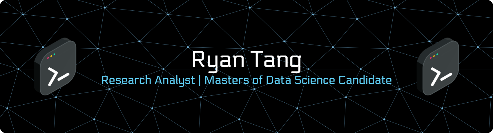

 

### 👋 INTRODUCTION

**"Decoding the mysteries of human behavior through data."**

I am an **Research Analyst** and **Master of Data Science** candidate.
My work bridges the gap between **Behavioral Psychology** and **Quantitative Analytics**.
I leverage machine learning and statistical rigor to translate complex human data into actionable business strategies.

 

---

### 🛠️ TECH STACK

*Full stack of quantitative research, data engineering, and visualization tools.*

 

---

### 📂 PORTFOLIO

*Selected works demonstrating predictive modeling and behavioral analytics.*

| **Project Category** | **Tech Used** | **Description** |
| :--- | :---: | :--- |
| **[Financial Forecasting (RNN)](https://github.com/ryantangx/Comparative-Analysis-of-RNN-LSTM-and-GRU-for-Financial-Forecasting)** | `TensorFlow` `Python` | Comparative analysis of RNN, LSTM, and GRU architectures on 10 years of stock data. |
| **Market Trend Analysis** | `Python` `Excel` | Analyzing consumer behavior and competitor strategies to drive business decisions. |
| **Behavioral Research** | `R` `SPSS` | **[Publication]** *Make it a habit:* The effect of nudges on habitual handwashing behavior. |
| **Data Visualization** | `Power BI` | Transforming raw datasets into interactive dashboards for diverse stakeholders. |

 

---

### 🚀 GROWTH

*"Continuous Improvement"*

Currently seeking to pivot fully into an **Analytics / Data Science** role.
I am expanding my expertise in **Machine Learning (ML)** and **AI** to apply predictive modeling to real-world problems.

 

 

### 📫 CONTACT

 
 

© 2026 Ryan Tang. Based in Malaysia.

