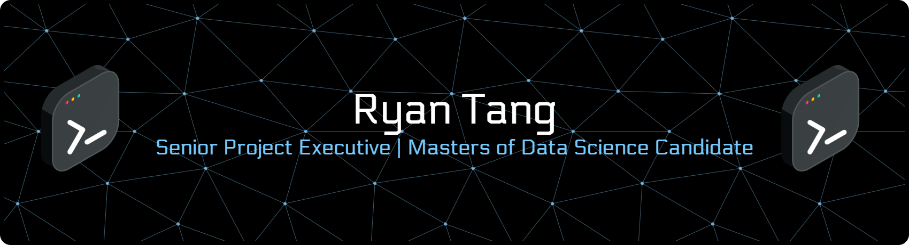

 

### 👋 INTRODUCTION

**"Decoding the mysteries of human behavior through data."**

I am an **Senior Project Executive** and **Master of Data Science** candidate.
My work bridges the gap between **Behavioral Psychology** and **Quantitative Analytics**.
I leverage machine learning and statistical rigor to translate complex human data into actionable business strategies.

 

---

### 🛠️ TECH STACK

*Full stack of quantitative research, data engineering, and visualization tools.*

 

---

### 📂 PORTFOLIO

*Selected works demonstrating predictive modeling and behavioral analytics.*

#### 🐍 Python: Machine Learning & Predictive Analytics

| **Project** | **Architecture** | **Description** |
| :--- | :--- | :--- |
| **💼 [Employee Attrition Prediction](https://github.com/ryantangx/Employee-Attrition-Prediction)** | **Random Forest Classifier** | Applied the PACE framework to achieve 99% precision in identifying turnover risks and providing strategic retention roadmaps. |
| **🎯 [Creator Monetization Clustering](https://github.com/ryantangx/Creator-Monetization-Archetypes)** | **K-Means Clustering** | Segmented social media creators into actionable personas to drive targeted monetization and retention strategies. |
| **📈 [Financial Forecasting](https://github.com/ryantangx/Comparative-Analysis-of-RNN-LSTM-and-GRU-for-Financial-Forecasting)** | **RNN, LSTM, GRU** | A rigorous comparative analysis of recurrent architectures on 10 years of stock data to predict price direction. |

#### 📊 R: Statistical Research & Behavioral Science

| **Project** | **Methodology** | **Description** |
| :--- | :--- | :--- |
| **⌚ [Smart Device Usage Analysis](https://github.com/ryantangx/Bellabeat-Smart-Device-Usage-Analysis)** | **Descriptive & Inferential Stats** | Strategic analysis of consumer usage trends to inform growth and marketing strategies for smart device wellness products. |
| **🧠 [Handwashing Habit Formation](https://github.com/ryantangx/Behavioral-Analytics-Handwashing)** | **One-Way ANOVA & Longitudinal Analysis** | **[Publication]** Investigated digital nudge efficacy on habit formation using a between-subjects experimental design and high-reliability psychometrics. |

#### 📈 BI & Data Visualization

| **Project** | **Tooling** | **Description** |
| :--- | :--- | :--- |
| **📊 [Competitor Sales & Market Share Analysis](https://github.com/ryantangx/Competitor-Sales-Analysis)** | **Power BI** | Developed an interactive BI solution with time intelligence, competitor benchmarking, and AI-driven root cause diagnostics. |
| **🏥 [Hospital Operational Efficiency & Cost Analysis](https://github.com/ryantangx/Healthcare-Efficiency-Analysis)** | **Power BI** | Evaluated 26,000+ patient records across 151 hospitals using outlier quadrant mapping and AI root cause diagnostics to optimize LOS and cost drivers. |
| **👥 [Workforce Attrition & Demographics Intelligence](https://github.com/ryantangx/Atlas-Labs-HR-Analytics)** | **Tableau** | Built an executive HR dashboard tracking 1,470 employees to isolate turnover drivers across travel demand, age cohorts, and tenure milestones. |
| **📦 [Retail Supply Chain & Inventory Analytics](https://github.com/ryantangx/Retail-Supply-Chain-Analytics)** | **Tableau** | Integrated multi-source logistics and inventory data to evaluate carrier delays against historical baselines, optimize carrying costs, and balance supply vs. demand. |

#### 🗄️ SQL: Data Modeling & Business Analytics

| **Project** | **Architecture / Concepts** | **Description** |
| :--- | :--- | :--- |
| **🦄 [Unicorn Companies & Industry Trends](https://github.com/ryantangx/Analyzing-Unicorn-Companies)** | **CTEs, Multi-Table Joins, Date Extraction** | Analyzed 2019–2021 unicorn emergence rates and tracked average valuation trends across high-growth sectors. |
| **🏍️ [Motorcycle Part Sales Analysis](https://github.com/ryantangx/Analyzing-Motorcycle-Part-Sales)** | **Aggregation, Date Formatting, Cohort Filtering** | Modeled net revenue by deducting payment processing fees across product lines, months, and warehouse facilities. |
| **⚙️ [Manufacturing Process Evaluation](https://github.com/ryantangx/Evaluating-A-Manufacturing-Process)** | **Window Functions, Named Frames, Nested Queries** | Built an automated 3-sigma UCL/LCL quality monitoring alert system across rolling 5-part batches. |

 

---

### 🚀 GROWTH

*"Continuous Improvement"*

Currently seeking to pivot fully into an **Analytics / Data Science** role.
I am expanding my expertise in **Machine Learning (ML)** and **AI** to apply predictive modeling to real-world problems.

 

 

### 📫 CONTACT

 
 

© 2026 Ryan Tang. Based in Malaysia.

